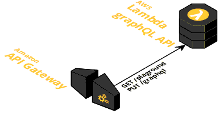

# First experiment with GraphQL on .NetCore with ASP.NET

Features: 
- `/graphql` endpoint
- `/plaground` endoint
- testable MVC layers (Unit, Integration)
- no Controllers in self code - all is referenced by .nugets
- EntityFramework for DB handling
- everything runs/builds from Linux  

Main project: __graphql.api__

App can work in 2 versions:
* as usual service - throw main endpoint
* as lambda handler - throw lambda endopint

DBs: 
* supproted 2 version - Postgres and InMemory. 
* _Watch Startup.cs for switch logic_

## Local workflow
Initially started and inspired by: https://github.com/JacekKosciesza/StarWars \
Additions: https://github.com/mmacneil/ASPNetCoreGraphQL/tree/master/src/backend/NHLStats.Api

### Prepare DB (with docker)
* `docker volume create postgres`
* `docker run -d -v /etc/localtime:/etc/localtime:ro -v postgres:/var/lib/postgresql/data:z -p 5432:5432 --name=postgres postgres:9.6`
* connect to Postgre service and create role 'Star' with pass 'Wars' and DB 'StarWars'
* run migration commands:
  ```
  cd graphql.data
  dotnet ef migrations add Inital -o ./EntityFramework/Migrations -v #create migration tagged - Inital
  dotnet ef update  #apply migrations 
  ```
  * Development nuances: Between inital migration (with 1 table of only ID and Name) and next (with other characters) I had to drop and revert all
    and recreate Initial migration (patching - failing)
### Run
* just usual 'build and run' from IDE or `dotnet` command line

## Lambda workflow



### Prepare DB
* currently not implemented - used InMemory

### Infra (currently manual)
* create API GW with 
  * GET /playground
  * POST /graphql
  * create new stage or use default /dev one
* create lambda function
  * with typical role that API GW can invoke it
  * place function name into [aws-lambda-tools-defaults.json](./graphql.api/aws-lambda-tools-defaults.json) under `function-name`
  * place other detail on AWS into this file
  
### Deploy version
* Install [dotnet Lambda pugin](https://github.com/aws/aws-extensions-for-dotnet-cli)
* run `dotnet lambda deploy-function` in `graphql.api` folder
* all details will be taken from [aws-lambda-tools-defaults.json](./graphql.api/aws-lambda-tools-defaults.json)

### Playground usage
* after open playground open settings and add `stage` path to the graphql endpoint

### Limitations
* Read logs not embedded into any cli tool now. Read from CloudWatch.
* [Serverless](https://serverless.com) deploy plugin currently not working

### Performance

### on 256MB of memory
* 1sec for first GET request (request of playground)
* 5-7sec for first POST request (request of schema)
  * it looks like this is the case of lazy inititaliztion
* next schema request took ~ 200ms, simple query ~ 10ms

### on 1792MB of memory
* 160ms for first GET request (request of playground)
* 850ms for first POST request (request of schema)
  * it looks like this is the case of lazy inititaliztion
* next schema request took ~ 35ms, simple query ~ 4ms

## Skipped or unclear parts

### Logging

For logging used Lambda logger package. It's settings work correctly on local run, but on Lambda - it still write everything (not follow settings) 

### [Test Coverage by OpenCover](https://github.com/JacekKosciesza/StarWars#code-coverage)

* install OpenCover nuget package
* add it to path
* add `<DebugType>Full</DebugType>` to *.csproj <PropertyGroup> to enable PBD files generation
* run as 
```
OpenCover.Console.exe
    -target:"dotnet.exe"
    -targetargs:"test -f netcoreapp1.1 -c Release Tests/StarWars.Tests.Unit/StarWars.Tests.Unit.csproj"
    -hideskipped:File
    -output:coverage/unit/coverage.xml
    -oldStyle
    -filter:"+[StarWars*]* -[StarWars.Tests*]* -[StarWars.Api]*Program -[StarWars.Api]*Startup -[StarWars.Data]*EntityFramework.Workaround.Program -[StarWars.Data]*EntityFramework.Migrations* -[StarWars.Data]*EntityFramework.Seed*"
    -searchdirs:"Tests/StarWars.Tests.Unit/bin/Release/netcoreapp1.1"
    -register:user
```
* include in script and enjoy by html report 
```bash
mkdir coverage\unit
OpenCover.Console.exe -target:"dotnet.exe" -targetargs:"test -f netcoreapp1.1 -c Release Tests/StarWars.Tests.Unit/StarWars.Tests.Unit.csproj" -hideskipped:File -output:coverage/unit/coverage.xml -oldStyle -filter:"+[StarWars*]* -[StarWars.Tests*]* -[StarWars.Api]*Program -[StarWars.Api]*Startup -[StarWars.Data]*EntityFramework.Workaround.Program -[StarWars.Data]*EntityFramework.Migrations* -[StarWars.Data]*EntityFramework.Seed*" -searchdirs:"Tests/StarWars.Tests.Unit/bin/Release/netcoreapp1.1" -register:user
ReportGenerator.exe -reports:coverage/unit/coverage.xml -targetdir:coverage/unit -verbosity:Error
start .\coverage\unit\index.htm
```
