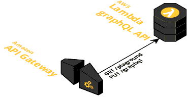

# First experiment with GraphQL on .NetCore without ASP.NET

Features: 
- pure resolving of GraphQL request via Lambda
- any endpoint name is fine
- no ASP.NET references, only DI

- testable MVC layers (Unit, Integration)
- no Controllers in self code - all is referenced by .nugets
- EntityFramework for DB handling
- everything runs/builds from Linux  

Main project: __graphql.api__

App can work only in 1 version:
* as lambda handler - throw lambda endopint

DBs: 
* supproted 2 version - Postgres and InMemory. 
* _Watch Startup.cs for switch logic_

## Local workflow
_Under construction_ Idea is to use LocalStack to emulate AWS. 
No webservice-proxy added on purpose

### Prepare DB (with docker)
* `docker volume create postgres`
* `docker run -d -v /etc/localtime:/etc/localtime:ro -v postgres:/var/lib/postgresql/data:z -p 5432:5432 --name=postgres postgres:9.6`
* connect to Postgre service and create role 'Star' with pass 'Wars' and DB 'StarWars'
* run migration commands:
  ```
  cd graphql.data
  dotnet ef migrations add Inital -o ./EntityFramework/Migrations -v #create migration tagged - Inital
  dotnet ef update  #apply migrations 
  ```
  * Development nuances: Between inital migration (with 1 table of only ID and Name) and next (with other characters) I had to drop and revert all
    and recreate Initial migration (patching - failing)
### Run
* just usual 'build and run' from IDE or `dotnet` command line

## Lambda workflow



### Prepare DB
* currently not implemented - used InMemory

### Infra (currently manual)
* create API GW with 
  * GET /playground -> from another lambda, or run playground localy
  * POST /any-name -> to this lambda
  * create new stage or use default /dev one
* create lambda function
  * with typical role that API GW can invoke it
  * place function name into [aws-lambda-tools-defaults.json](./graphql.api/aws-lambda-tools-defaults.json) under `function-name`
  * place other detail on AWS into this file
  
### Deploy version
* Install [dotnet Lambda pugin](https://github.com/aws/aws-extensions-for-dotnet-cli)
* run `dotnet lambda deploy-function` in `graphql.api` folder
* all details will be taken from [aws-lambda-tools-defaults.json](./graphql.api/aws-lambda-tools-defaults.json)

### Playground usage
* after open playground open settings and add `stage/route` path to the graphql endpoint

### Limitations
* Read logs not embedded into any cli tool now. Read from CloudWatch.
* [Serverless](https://serverless.com) deploy plugin currently not working

### Performance

### on 256MB of memory
* 4-4.5sec for first POST request (request of schema)  
* next schema request took ~ 50ms, simple query ~ 2-20ms
  * ~ 10-15% less then in ASP.NET usage. For details - needs more tests
* memory consumption 48MB.
  * ~ 10-15% less then in ASP.NET usage 

### on 1792MB of memory
* 800ms for first POST request (request of schema)
* next schema request took ~ 6ms, simple query ~ 1-5ms
  * ~ 10-15% less then in ASP.NET usage. For details - needs more tests
* memory consumption 87MB.
  * ~ 10-15% less then in ASP.NET usage (100MB)

## Skipped or unclear parts

### Logging

For logging used Lambda logger package. It's settings work correctly on local run, but on Lambda - it still write everything (not follow settings) 