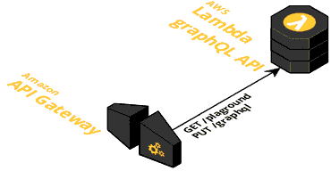

# Spike on how to leverage tech stack of [GraphQL](https://graphql.github.io/), [AWS Lambda](https://aws.amazon.com/lambda/) and [.NetCore](https://github.com/dotnet/core)

It compares 2 major decisions:
 * GraphQL Schema First vs. Graph Type First of [GraphQL.Net](https://graphql-dotnet.github.io/)
 * Asp.Net web hosting vs. .Net with handler
 
It takes 3 experiments:
 * GraphQL Graph Type First & Asp.Net web hosting in [Graphql.Api.Aspnet.GraphType](Graphql.Api.Aspnet.GraphType) project 
 * GraphQL Schema First & Asp.Net web hosting in [Graphql.Api.Aspnet.SchemaFirst](Graphql.Api.Aspnet.SchemaFirst) project
 * GraphQL Schema First & .Net with handler in [Graphql.Api.Dotnet.SchemaFirst](Graphql.Api.Dotnet.SchemaFirst) project
 
The rest part of projects are shared across these projects. Tests also because content is identical.

Database has 2 implementations:
 * InMemory - widely used across tests and experiments
 * Postgres with EntityFramework - tested and works for local runs
 
## How to run

### Local run of Asp.Net versions with InMemory DB on Linux / Window / Mac
 * install DotNet Core 2.1 SDK
 * clone this repo
 * run in console from repo root dir
    * for Mac or Linux `export ASPNETCORE_ENVIRONMENT=Test && dotnet run -p Graphql.Api.Aspnet.GraphType` or `export ASPNETCORE_ENVIRONMENT=Test && dotnet run -p Graphql.Api.Aspnet.GraphType` 
    * for Window PowerShell `$env:ASPNETCORE_ENVIRONMENT=Test; dotnet run -p Graphql.Api.Aspnet.GraphType` or `$env:ASPNETCORE_ENVIRONMENT=Test; dotnet run -p Graphql.Api.Aspnet.GraphType` 
 * open playground in browser [http://localhost:5051/playground](http://localhost:5051/playground)
 * call GraphQL queries 

### Local run of Asp.Net versions with PostrgesDB on Linux / Window / Mac
 * [prepare PostgresDB](#prepare-postgresdb-with-docker) on your local machine and apply migrations
 * follow the previous section with InMemory, but run without environment variable
    * for Mac, Linux, Windows PowerShell `dotnet run -p Graphql.Api.Aspnet.GraphType` or `dotnet run -p Graphql.Api.Aspnet.GraphType` 
    
### Local run of .Net version
 * currently not supported
 * there is a chance to make it work with [LocalStack](https://github.com/localstack/localstack) in Docker, but it won't work out of the box
 
### Run in AWS Lambda
 
 
 * prepare infrastructure (manually at this time, detailed explanation out of scope this time) 
   * create API GW with
     * GET /playground
     * POST /graphql
     * create new stage or use default /dev one
   * create lambda function
     * with typical role that API GW can invoke it
     * set function name on key `function-name` in `aws-lambda-tools-defaults.json` file in your project version 
     * place other details on AWS into this file
   * currently used InMemory DB - no need for infra
  
 * deploy version   
   * install [dotnet Lambda pugin](https://github.com/aws/aws-extensions-for-dotnet-cli)
   * run in console `dotnet lambda deploy-function` in folder of your project version 
   * all details will be taken from `aws-lambda-tools-defaults.json`

 * usage
   * open playground in browser
   * in graphql endpoint add stage name, to match
   * run queries
   
 * limitations
   * .Net version do not provider embedded playground - any other playground can be used instead 

### Prepare local PostgresDB with docker
* install Docker
* `docker volume create postgres`
* `docker run -d -v /etc/localtime:/etc/localtime:ro -v postgres:/var/lib/postgresql/data:z -p 5432:5432 --name=postgres postgres:9.6`
* connect to Postgre service and create role 'Star' with pass 'Wars' and DB 'StarWars'
* run migration commands:  
```
  cd graphql.data
  dotnet ef migrations add Inital -o ./EntityFramework/Migrations -v # create migration tagged - Inital
  dotnet ef update  # apply migrations 
```  

## Testing
  * implemented DI which allow to cover app with test on different levels (Unit, Integration) and layers (for API, Domain, DB)
  * no controllers in my code - all is referenced to mainstream community packages, and tested accordingly
  * DI and .Net Core allows to use InMemory DB a lot which decouple Api and Data layers for testability

## Performance

All [performance of Lambda function](https://docs.aws.amazon.com/lambda/latest/dg/best-practices.html#function-configuration) is controlling throw Memory Limit - CPU, Networking, etc

| Lambda memory | AspNet version                                                                                                                                                       |  .Net version                                                                                                                                |
|---------------|----------------------------------------------------------------------------------------------------------------------------------------------------------------------|----------------------------------------------------------------------------------------------------------------------------------------------|
|     256MB     | 5-7sec for first POST request (request of schema) <br> next schema request took ~ 200ms <br> simple query ~ 10ms <br> memory consumtion 56MB <br> 1sec first GET request of playground | 4-4.5sec for first POST request (request of schema) <br> next schema request took ~ 50ms <br> simple query ~ 2-20ms <br> memory consumption 48MB    |
|     1792MB    | 850ms for first POST request (request of schema) <br> next schema request took ~ 35ms <br> simple query ~ 4ms <br> memory consumption 98MB <br> 160ms first GET request of playground   | 800ms for first POST request (request of schema) <br> next schema request took ~ 6ms <br> simple query ~ 1-5ms <br> memory consumption 87MB.        | 

In average .Net version consume ~10-15% less memory & faster then Asp.Net version. For more accurate results needed real load testing 

## Current decision

Take __GraphQL Schema First__ - it requires less code to write and easier to understand when work on schema.
While it is not full featured as Graph Types - it's better to live with that now, and contribute into future  
Take  __Asp.Net version__ - while it's not as fast as pure .Net version, it is much easier to work with it on local, 
while you develop a lot. It's not hard to replace it in future - just re-write Startup and Handler and you good to go. 

## Parts to clarify (future work)

### Logging

For logging used Lambda logger package. It's settings work correctly on local run, but on Lambda - it is not follow settings.

### Logs streaming

Easy way to read logs not embedded into otnet CLI tool now. Read from CloudWatch.
Making it better heavily rely deployment + infra framework

### Deployment and Infra

For now there 2 options to choose:
* [Serverless](https://serverless.com)
* [Terraform](https://www.terraform.io/) + dotnet CLI with [plugin](https://github.com/aws/aws-extensions-for-dotnet-cli)

Also [SAM](https://github.com/awslabs/serverless-application-model) - but it didn't fly for me.

### Support of metadata, refs from Schema First

Develop plugin to make Schema First better 

## Credits
Initially inspired by: https://github.com/JacekKosciesza/StarWars \
Additions: https://github.com/mmacneil/ASPNetCoreGraphQL/tree/master/src/backend/NHLStats.Api